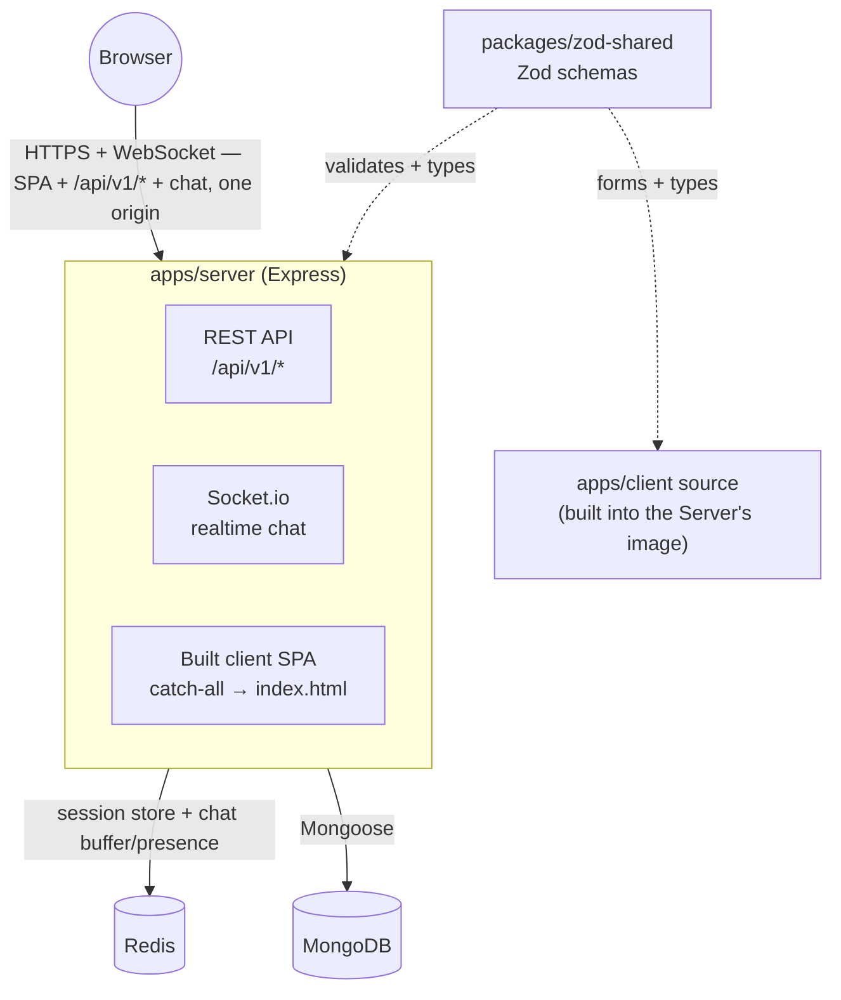
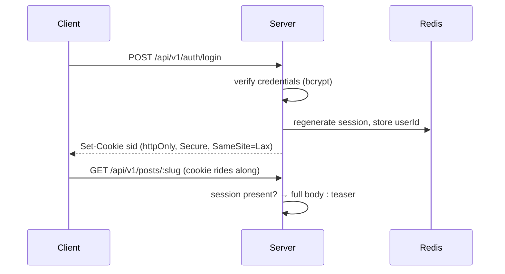
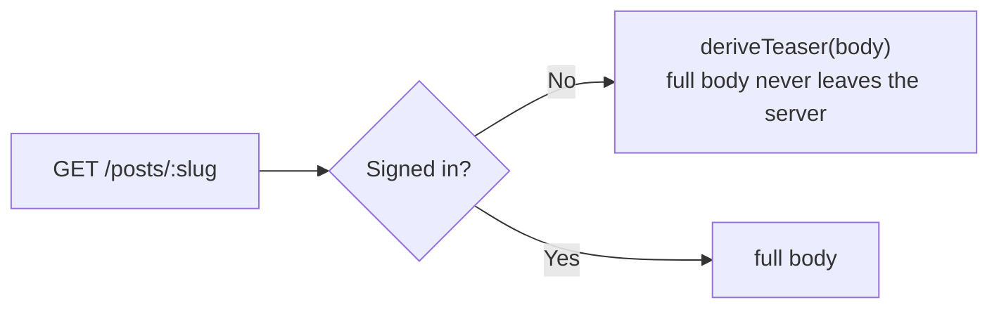
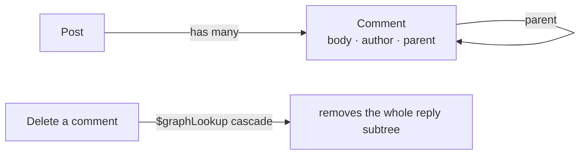

## About

A MERN blog + chat app. It reimplements every real feature of the legacy app — session auth, posts,
likes, threaded comments, search — while fixing five documented authorization holes the original had,
and adds genuine upgrades (server-side session auth instead of a client-stored JWT, per-reader content
gating, MongoDB-backed full-text search, realtime chat over Socket.io, Google sign-in) the legacy app
never had.

## Architecture



**One origin, one deployed service.** `apps/server` serves the REST API, the built client SPA, and the
Socket.io realtime chat server — no separate frontend or realtime service, no CORS anywhere, and the
httpOnly session cookie behaves identically in dev, CI, and prod. `packages/zod-shared` is the cross-app
package: the same Zod schema validates a request on the server and drives the matching form on the
client. Realtime chat (P4) runs in this same process rather than as a separate service, so it inherits the
same origin and the same session instead of needing an auth handshake of its own. Full rationale:
`docs/superpowers/specs/2026-07-16-express-react-rebuild-design.md` and
`docs/superpowers/specs/2026-07-29-realtime-chat-design.md`.

## Core flows, in a nutshell

**Auth & session** — login/signup regenerate the session *before* writing identity (blocks session
fixation), and the client only ever holds an httpOnly cookie, never a token:



**Content gating** — every post is teased for anonymous readers and full for any signed-in one (no paid
tier — signing up, which is free, is what unlocks content). Gating happens once, at serialization, so
there is nothing to find in DevTools for a body the server never sent:



**Comments** — threaded and Markdown-rendered, never gated (only a post's own body is):



**Search** — MongoDB's native `$text` index over `{ title, body }`, run by the database, not a
client-side `Array.filter`. See "Search semantics" below for the word-matching behavior this implies.

## Tech stack

| Layer | What's used |
|---|---|
| Server | Express 5 · Socket.io (realtime chat) · Mongoose 8 (MongoDB) · `express-session` + `connect-redis` (Redis-backed sessions) · bcryptjs · Helmet · Zod · Cloudinary (signed image uploads) · Passport (Google OAuth) |
| Client | React 19 · Vite · TanStack Query · React Router 8 · Tailwind CSS 4 · `react-markdown` + `remark-gfm` |
| Shared | Zod schemas in `packages/zod-shared`, the single source of truth for both server validation and client forms |
| Testing | Vitest · Supertest · `mongodb-memory-server` · Testing Library · Playwright (e2e) |
| Tooling / infra | TypeScript · ESLint (flat config) · Docker (multi-stage) · Docker Compose · GitHub Actions · Render (target host — see Deploying below) |

## Core features

- **Auth** — signup/login/logout on server-side sessions; self-service profile update and account deletion.
- **Google sign-in** — OAuth via Passport, sharing the same session as password login. A federated profile
  links to an existing account only when Google confirms it verified the email; an unverified address is
  attacker-controlled, so matching on it is refused rather than granting the account.
- **Posts** — create/edit/delete, tags, per-reader content gating on every read.
- **Likes** — idempotent (`PUT`/`DELETE`, not a toggle endpoint), optimistic UI with rollback on failure.
- **Threaded comments** — Markdown editor with a live preview, cascade-delete of reply subtrees.
- **Search** — full-text search plus tag filtering over the feed, debounced, bookmarkable via the URL.
- **Realtime chat** — one room, signed-in only, with presence and typing indicators; recent history is
  loaded from Redis on join, and messages live only in Redis, never in MongoDB.
- **Cover images** — optional per post, uploaded straight to Cloudinary from the browser against a
  short-lived signature the API issues; only the public ID is stored, so the delivery host can change
  without rewriting documents.
- **Generated cover art** — a post with no uploaded cover gets a deterministic canvas drawing keyed to its
  slug, so the feed is image-led whether or not the author supplied a picture.

**Demo capacity caps.** This is a portfolio demo on free-tier infrastructure, so it is deliberately
capped: **20 accounts, 3 posts per account, 10 comments per post**. Exceeding one returns `403` with a
message naming which limit was hit — the app is not broken, it is full. Limits are env-driven
(`DEMO_MAX_*`), enforced in the service layer, and scoped per owner so no single visitor can consume
everyone else's allowance.

**Not yet built (by design, not oversight):** Facebook sign-in and avatar uploads. The Facebook strategy is
written and dormant — it needs only credentials — but Facebook's HTTPS redirect requirement makes it poor
value for a demo, so only Google is wired up. See the phase table in
`docs/superpowers/specs/2026-07-16-express-react-rebuild-design.md` §13 for what's next.

Both integrations are optional infrastructure. With no `CLOUDINARY_*` variables the API still boots, the
upload endpoint reports 503, and every post falls back to its generated cover. With no `GOOGLE_*`
variables there is simply no Google button — `GET /api/v1/auth/providers` tells the client which providers
this deployment can offer, so a missing credential never produces a button that fails.

## Quick start

```bash
cp .env.example .env       # then fill in SESSION_SECRET
npm install
npm run dev                # docker compose watch — api, client, mongo, redis
npm run seed               # demo data + a demo account (local only)
```

The client is on http://localhost:5173, proxying `/api` to the API on http://localhost:3000/api/v1 —
same origin as prod, so the session cookie behaves identically in dev.

### Running the stack with Docker Compose directly

`npm run dev` is a thin wrapper. The underlying command, and the rest of the day-to-day set:

```bash
# Start everything with hot reload (api, client, mongo, redis). Foreground.
docker compose -f infra/compose.yaml --project-directory . watch

# Or detached, without file watching
docker compose -f infra/compose.yaml --project-directory . up -d

docker compose -f infra/compose.yaml --project-directory . ps
docker compose -f infra/compose.yaml --project-directory . logs -f api
docker compose -f infra/compose.yaml --project-directory . down        # stop
docker compose -f infra/compose.yaml --project-directory . down -v     # stop and wipe the volumes
```

**`--project-directory .` is not optional, and it must be run from the repo root.** The compose file's
`context`, `develop.watch` and `secrets` paths are written relative to the repo root, but Compose resolves
them relative to the compose file's own directory — `infra/`. Omit the flag and the build context is wrong.

**Use `watch`, not `up -d`, while developing.** Containers bake their source at build time, so a detached
stack keeps serving the code from whenever it was built. `restart` does not help — it restarts the same
stale image. If an edit isn't showing up, that's why:

```bash
docker compose -f infra/compose.yaml --project-directory . up -d --build   # force a rebuild
```

A change to `package.json` or `package-lock.json` forces a full rebuild even under `watch`, because
dependencies are installed into the image rather than synced.

| Service | Port | Notes |
|---|---|---|
| `client` | 5173 | Vite dev server; proxies `/api` and the Socket.io upgrade to `api` |
| `api` | 3000 | Express + Socket.io |
| `mongo` | 27019 → 27017 | Bound to `127.0.0.1` only |
| `redis` | 6379 | Bound to `127.0.0.1` only |

**The production image**, which is what CI runs the E2E against and what Render deploys, is a different
stack — `target: runner` rather than `target: dev`, with the client's built bundle served by the API
rather than by Vite:

```bash
docker compose -f infra/compose.e2e.yaml --project-directory . up --build --wait
npm run test:e2e
docker compose -f infra/compose.e2e.yaml --project-directory . down -v
```

**If a build fails** with `UNABLE_TO_VERIFY_LEAF_SIGNATURE` or npm's `Exit handler never called!`, local
TLS interception is breaking `npm ci` inside the container. `infra/compose.override.yaml` (gitignored)
feeds the exported root CA in as a build secret, and because this repo always passes `-f` explicitly,
Compose will **not** auto-merge it — pass it explicitly too:

```bash
docker compose --project-directory . -f infra/compose.yaml -f infra/compose.override.yaml watch
```

Never bake a CA certificate into an image, and never commit one.

### Trying the chat

Chat needs two signed-in users, so open a second **incognito/private** window rather than a second tab —
two tabs share one session and you would be talking to yourself.

```bash
npm run dev                # wait for all four containers to report healthy
npm run seed               # creates demo/reader; prints the shared password (local only)
```

1. Sign in as `demo` at http://localhost:5173/login, open **Chat** in the nav.
2. In a private window, sign in as `reader` and open Chat too.
3. Type in one window — the message, the online count and the typing indicator all update in the other.
4. Reload either window: the last 50 messages come back from Redis. Restart the `redis` container and
   they do not — the buffer is deliberately ephemeral, and that is the design working, not a bug.

The socket is served by the API process on the same origin, so there is no separate service to start.
`/chat` redirects to `/login` when signed out; that guard is UX only — the socket handshake rejects a
sessionless connection server-side regardless.

**If the containers fail to build** with `UNABLE_TO_VERIFY_LEAF_SIGNATURE` or npm's
`Exit handler never called!`, that is local TLS interception breaking `npm ci` inside the container, not
a problem with the code. See the `extra-ca` note in `CLAUDE.md`; the certificate has to be re-exported
whenever the interceptor rotates it.

**Deploying:** `render.yaml` declares this rebuild's target Render service, but it has not been
promoted to `master`/deployed yet — there is no live URL for it. (`master`'s legacy app is separately
live on Render today; that deployment predates this rebuild and is unrelated to it.)

## The API, if you want to bypass the UI

```bash
# Anonymous: the body is a teaser. The full text is not in the response at
# all — the API never serialized it.
curl -s localhost:3000/api/v1/posts/gating-content-at-the-serialization-boundary

# Signed in: the full body.
curl -s -c jar -X POST localhost:3000/api/v1/auth/login \
  -H 'Content-Type: application/json' \
  -d '{"username":<username>,"password":<password>}'
curl -s -b jar localhost:3000/api/v1/posts/gating-content-at-the-serialization-boundary
```

## Search semantics

The feed's search box runs on MongoDB's native `$text` index over `{ title, body }`
(`apps/server/src/models/post.ts`) — the database does the matching, not a client-side
`Array.filter` over an already-downloaded page (which is all the legacy app ever did).

`$text` matches **whole, stemmed words — never substrings**. Two consequences worth knowing
before assuming a search result is wrong:

- A single letter like `e` matches nothing. It isn't a real standalone word anywhere in the
  text — `$text` only indexes and matches whole words, so a letter that merely appears
  *inside* words like "the" or "serialize" doesn't count as a match. The same reason a
  half-typed word like `mongo` won't find `MongoDB`: matching resumes once the word is
  finished, not before.
- A short, common word like `API` can legitimately return every post in the demo dataset —
  that isn't the filter falling through to "no filter," it's a real match: the seeded posts
  are about this project's own API rebuild, so each one's body genuinely contains the word.

An empty or whitespace-only search is dropped before it reaches Mongo (`$text: { $search: '' }`
is a query error) and degrades to the unfiltered feed instead.

## Scripts

| Command | What it does |
|---|---|
| `npm run dev` | Full stack via `docker compose watch`, hot reload |
| `npm run seed` | Wipe and reseed the **local** dataset. Ignores `MONGODB_URI`, so it can never reach production |
| `npm run seed:prod` | Reseed **production**. Requires `MONGODB_URI` and refuses a local one |
| `npm run typecheck` | Per-workspace `tsc --noEmit` — CI runs this on every PR |
| `npm run lint` | ESLint (flat config) — CI runs this on every PR |
| `npm run test` | Vitest unit + Supertest integration |
| `npm run test:e2e` | Playwright, against the production Docker image |
| `npm run build` | Production build (client Vite bundle + server tsup bundle) |

Two things worth knowing about `docker compose watch`: source edits under `apps/` sync into the running
containers, but a change to `package.json` or `package-lock.json` triggers a full **rebuild** — so pulling
a branch that adds a dependency means waiting for `npm ci` to run inside the container again. And the
containers bake source at build time, so if an edit genuinely is not showing up, rebuild before debugging
the code.
