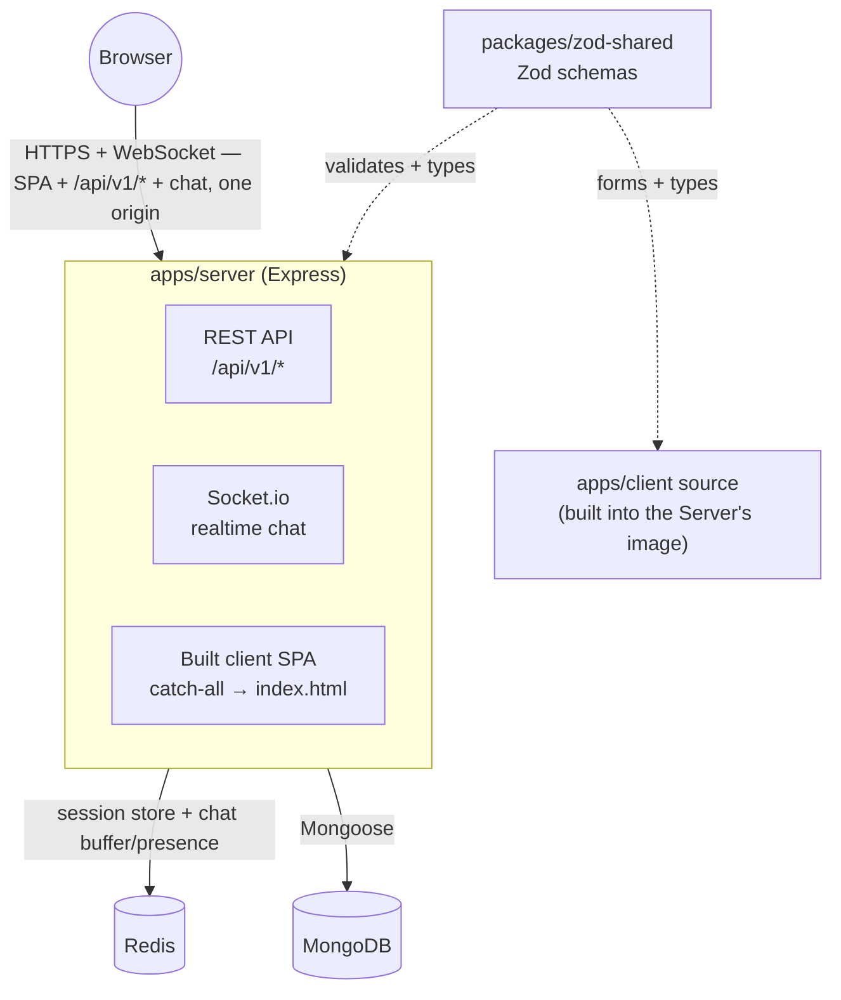
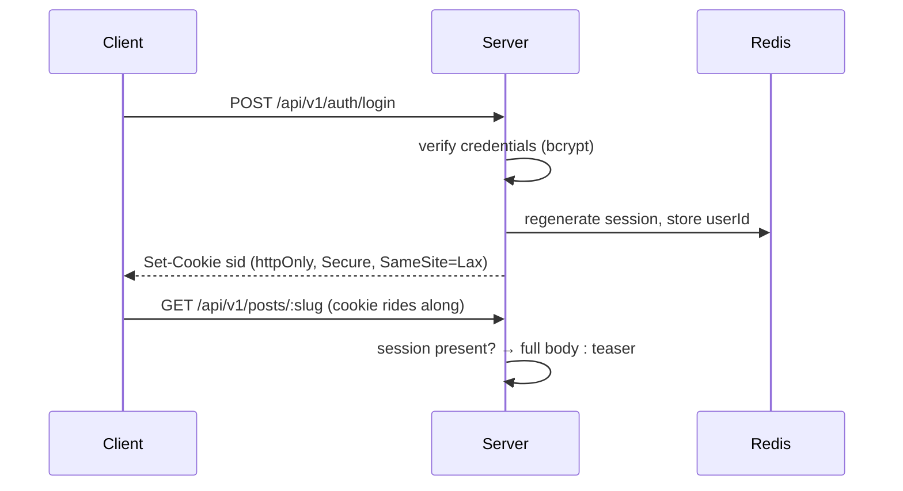
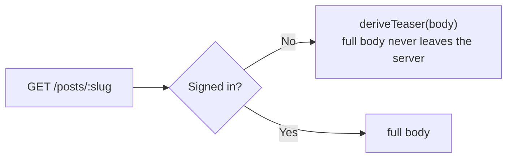
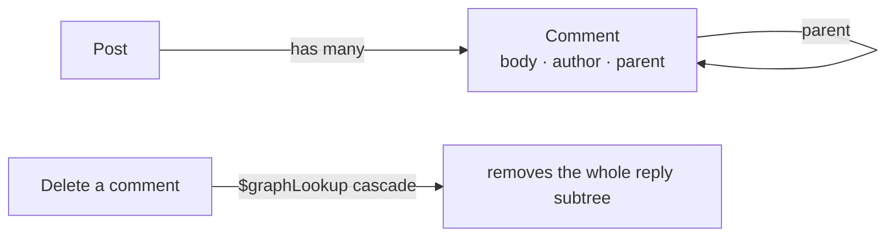

# Blog-Chat

> **Two codebases live in this repo.** `master` is the original 2021 MERN (CRA + Redux + Express +
> Socket.io) app, still live in production. Everything below describes the from-scratch rebuild on
> `staging` — Express + React (Vite) + TypeScript — which is what you get from a fresh clone. See
> `CLAUDE.md` and `docs/superpowers/specs/2026-07-16-express-react-rebuild-design.md` for the full
> design rationale and phase history.

## About

A from-scratch rebuild of a five-year-old MERN blog + chat app, built as a portfolio piece targeting
fullstack/backend roles. It reimplements every real feature of the legacy app — session auth, posts,
likes, threaded comments, search — while fixing five documented authorization holes the original had,
and adds genuine upgrades (server-side session auth instead of a client-stored JWT, per-reader content
gating, MongoDB-backed full-text search, realtime chat over Socket.io) the legacy app never had. OAuth
login is designed but intentionally not built yet.

## Architecture



**One origin, one deployed service.** `apps/server` serves the REST API, the built client SPA, and the
Socket.io realtime chat server — no separate frontend or realtime service, no CORS anywhere, and the
httpOnly session cookie behaves identically in dev, CI, and prod. `packages/zod-shared` is the cross-app
package: the same Zod schema validates a request on the server and drives the matching form on the
client. Realtime chat (P4) runs in this same process rather than as a separate service, so it inherits the
same origin and the same session instead of needing an auth handshake of its own. Full rationale:
`docs/superpowers/specs/2026-07-16-express-react-rebuild-design.md` and
`docs/superpowers/specs/2026-07-29-realtime-chat-design.md`.

## Core flows, in a nutshell

**Auth & session** — login/signup regenerate the session *before* writing identity (blocks session
fixation), and the client only ever holds an httpOnly cookie, never a token:



**Content gating** — every post is teased for anonymous readers and full for any signed-in one (no paid
tier — signing up, which is free, is what unlocks content). Gating happens once, at serialization, so
there is nothing to find in DevTools for a body the server never sent:



**Comments** — threaded and Markdown-rendered, never gated (only a post's own body is):



**Search** — MongoDB's native `$text` index over `{ title, body }`, run by the database, not a
client-side `Array.filter`. See "Search semantics" below for the word-matching behavior this implies.

## Tech stack

| Layer | What's used |
|---|---|
| Server | Express 5 · Socket.io (realtime chat) · Mongoose 8 (MongoDB) · `express-session` + `connect-redis` (Redis-backed sessions) · bcryptjs · Helmet · Zod |
| Client | React 19 · Vite · TanStack Query · React Router 8 · Tailwind CSS 4 · `react-markdown` + `remark-gfm` |
| Shared | Zod schemas in `packages/zod-shared`, the single source of truth for both server validation and client forms |
| Testing | Vitest · Supertest · `mongodb-memory-server` · Testing Library · Playwright (e2e) |
| Tooling / infra | TypeScript · ESLint (flat config) · Docker (multi-stage) · Docker Compose · GitHub Actions · Render (target host — see Deploying below) |

## Core features

- **Auth** — signup/login/logout on server-side sessions; self-service profile update and account deletion.
- **Posts** — create/edit/delete, tags, per-reader content gating on every read.
- **Likes** — idempotent (`PUT`/`DELETE`, not a toggle endpoint), optimistic UI with rollback on failure.
- **Threaded comments** — Markdown editor with a live preview, cascade-delete of reply subtrees.
- **Search** — full-text search plus tag filtering over the feed, debounced, bookmarkable via the URL.
- **Realtime chat** — one room, signed-in only, with presence and typing indicators; recent history is
  loaded from Redis on join, and messages live only in Redis, never in MongoDB.

**Not yet built (by design, not oversight):** OAuth login (planned P6) and media/avatar uploads. See the
phase table in `docs/superpowers/specs/2026-07-16-express-react-rebuild-design.md` §13 for what's next.

## Quick start

```bash
cp .env.example .env       # then fill in SESSION_SECRET
npm install
npm run dev                # docker compose watch — api, client, mongo, redis
npm run seed               # demo data + a demo account
```

The client is on http://localhost:5173, proxying `/api` to the API on http://localhost:3000/api/v1 —
same origin as prod, so the session cookie behaves identically in dev.

**Deploying:** `infra/render.yaml` declares this rebuild's target Render service, but it has not been
promoted to `master`/deployed yet — there is no live URL for it. (`master`'s legacy app is separately
live on Render today; that deployment predates this rebuild and is unrelated to it.)

## The API, if you want to bypass the UI

```bash
# Anonymous: the body is a teaser. The full text is not in the response at
# all — the API never serialized it.
curl -s localhost:3000/api/v1/posts/gating-content-at-the-serialization-boundary

# Signed in: the full body.
curl -s -c jar -X POST localhost:3000/api/v1/auth/login \
  -H 'Content-Type: application/json' \
  -d '{"username":<username>,"password":<password>}'
curl -s -b jar localhost:3000/api/v1/posts/gating-content-at-the-serialization-boundary
```

## Search semantics

The feed's search box runs on MongoDB's native `$text` index over `{ title, body }`
(`apps/server/src/models/post.ts`) — the database does the matching, not a client-side
`Array.filter` over an already-downloaded page (which is all the legacy app ever did).

`$text` matches **whole, stemmed words — never substrings**. Two consequences worth knowing
before assuming a search result is wrong:

- A single letter like `e` matches nothing. It isn't a real standalone word anywhere in the
  text — `$text` only indexes and matches whole words, so a letter that merely appears
  *inside* words like "the" or "serialize" doesn't count as a match. The same reason a
  half-typed word like `mongo` won't find `MongoDB`: matching resumes once the word is
  finished, not before.
- A short, common word like `API` can legitimately return every post in the demo dataset —
  that isn't the filter falling through to "no filter," it's a real match: the seeded posts
  are about this project's own API rebuild, so each one's body genuinely contains the word.

An empty or whitespace-only search is dropped before it reaches Mongo (`$text: { $search: '' }`
is a query error) and degrades to the unfiltered feed instead.

## Scripts

| Command | What it does |
|---|---|
| `npm run dev` | Full stack via `docker compose watch`, hot reload |
| `npm run seed` | Wipe and reseed the demo dataset |
| `npm run typecheck` | Per-workspace `tsc --noEmit` |
| `npm run lint` | ESLint (flat config) |
| `npm run test` | Vitest unit + Supertest integration |
| `npm run test:e2e` | Playwright, against the production Docker image |
| `npm run build` | Production build (client Vite bundle + server tsup bundle) |
