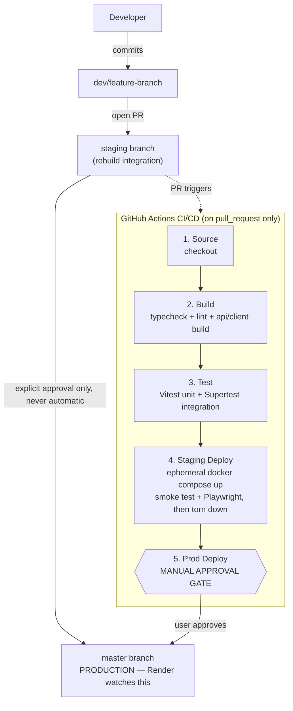
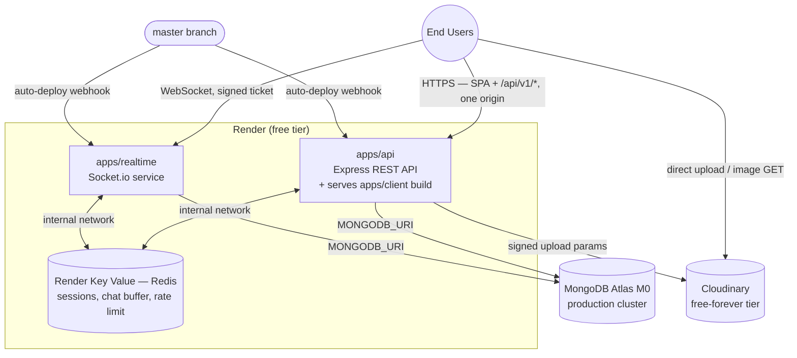
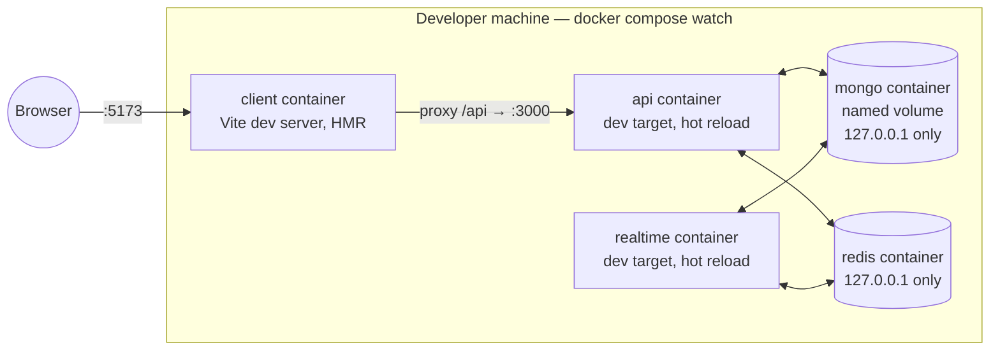
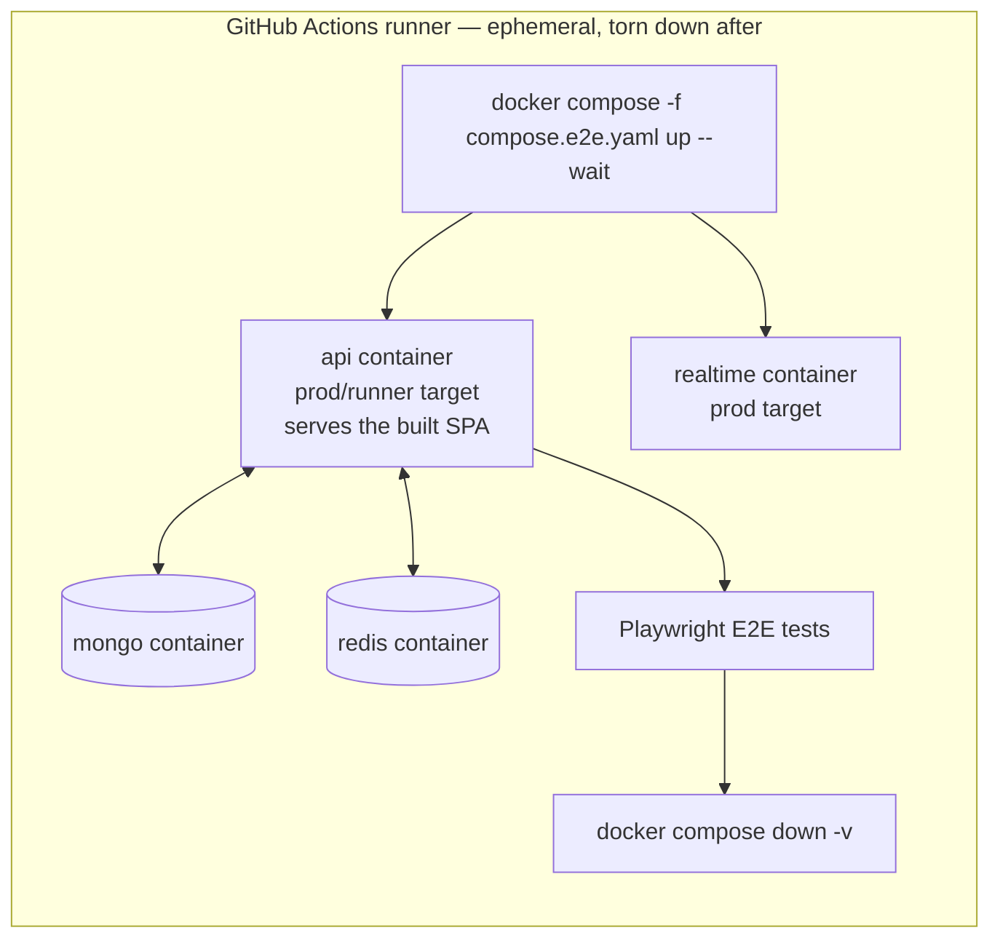

# Deployment Architecture

Living reference doc — update as the rebuild progresses. Unlike `docs/superpowers/specs` and
`docs/superpowers/plans` (dated, point-in-time planning artifacts), this file should stay current.

**Status legend:** ✅ live today · 🚧 in progress · 📋 planned, not built yet

**Last verified against reality:** 2026-07-16, at the Express + React stack pivot.

---

## Current reality (read this first)

`master` is **live production**, watched by an existing Render service that auto-deploys on every push
(this predates the rebuild — it's how the original 2021 legacy app has been hosted). On 2026-07-16, a
rebuild PR was merged into `master`, deleting the legacy app's `Dockerfile`/`server/`/`src/`; Render's
next build failed (`open Dockerfile: no such file or directory`) and the live site went down. It was
fixed by reverting the merge on `master` and moving all rebuild work to a `staging` branch instead. See
the `never-autonomous-merge-or-deploy` and `renewal-branch-structure` memory entries for the full story.

**Consequence for this diagram:** `master` today runs the ✅ **legacy MERN app** (Express + CRA), not the
rebuild. Everything under "Target production topology" below is 📋 planned — it goes live only when
`staging` is deliberately promoted to `master`.

**Stack pivot (2026-07-16):** the rebuild was originally designed on Next.js 15; Tasks 1–7 were built
before the direction changed to **Express + React (Vite)**, to make the project a better portfolio piece
for fullstack/backend roles. `dev/web-app-scaffold` and `dev/ci-cd-pipeline` (PR #8) are abandoned
unmerged — retained in git history, never deleted. See
`docs/superpowers/specs/2026-07-16-express-react-rebuild-design.md` §2 and §13.

---

## Branch flow & CI/CD pipeline

**Status:** branch model (`dev/*` → `staging` → `master`) is ✅ live. The 5-stage workflow was built on
`dev/ci-cd-pipeline` (PR #8) against the Next.js layout and is now 📋 to be rebuilt — its *shape* carries
forward verbatim (`pull_request`-only trigger, per-workspace typecheck fanout, ephemeral stage 4, manual
gate at stage 5, `permissions: contents: read`, `concurrency` cancel-superseded). Only the build/test
commands change.

**Why the trigger is `pull_request` only:** a raw commit to a feature branch must never run CI — only
opening or updating a PR does.

**Why staging deploy is ephemeral, not a persistent cloud environment:** Render's free tier allows only
one Key Value (Redis) instance per workspace, so a second always-on staging environment would either
have to share prod's Redis or cost money. Spinning up the full Docker Compose stack inside the CI runner
for the duration of the test run avoids that constraint entirely and costs nothing.

**Stage 5 is a gate, not a deploy.** Render's own webhook performs the actual deploy when `master`
changes. The job exists to force a human approval step (GitHub Environment `production` + required
reviewer) and to make the pipeline stage explicit.

---

## Target production topology (📋 planned — not live yet)

| Component | Status | Notes |
|---|---|---|
| `apps/api` Render service | 📋 planned | P1. Serves the REST API **and** the built SPA from one origin — no CORS, no cross-origin cookie problem |
| `apps/client` | 📋 planned | P2. Vite build; static assets baked into the `apps/api` image, not a separate service |
| `apps/realtime` Render service | 📋 planned | P4 — Socket.io, separate service, cold starts accepted |
| Render Key Value (Redis) | 📋 planned | P1 (sessions) → P4 (chat buffer, presence) → P6 (rate limiting). Ephemeral by design |
| MongoDB Atlas M0 | ✅ exists, 🚧 being re-secured | Credential was leaked and rotated on 2026-07-16; cluster will be wiped and reseeded before go-live |
| Cloudinary | 📋 planned | P5 — replaces the S3 + CloudFront plan; free forever, no shared-AWS-account hazard |
| Socket auth across origins | 📋 planned | P4 — short-lived signed JWT ticket. Render subdomains are on the Public Suffix List, so the two services **cannot** share a session cookie |

**Why one service for API + client:** the session cookie is httpOnly and same-origin. Splitting the SPA
onto a Render Static Site would put it on a different `*.onrender.com` origin, forcing CORS plus
`SameSite=None` cookies — and would consume a second slice of the 750-hour free pool. `apps/realtime`
pays exactly that cost, which is why it needs the signed-ticket handshake instead of the cookie.

---

## Local development (📋 planned — P1)

`compose watch` syncs changed source files into the containers (not a bind mount) — avoids the
Windows `node_modules`/inotify problems a plain bind mount would hit.

**Vite's `server.proxy` forwards `/api` to the api container**, so the browser sees a single origin in
dev exactly as it will in prod. The auth model is therefore identical across dev, CI, and prod — a cookie
bug cannot hide until deploy.

**Mongo and Redis bind to `127.0.0.1`, never `0.0.0.0`** — they run unauthenticated locally, and
publishing them on all interfaces would expose an unauthenticated database to the LAN.

## CI ephemeral staging (📋 planned — `compose.e2e.yaml` + smoke test in P1; Playwright added in P2)

This is the literal implementation of pipeline stage 4 above — it builds the same `runner` Docker target
that would ship to Render, so a broken production build fails here, not after a real deploy.

**Note:** `compose.e2e.yaml` did not exist when stage 4 was first written, which is why PR #8's CI run
failed on it. In the new plan the file lands in P1 alongside the API, so the stage has something real to
stand up from the start.
